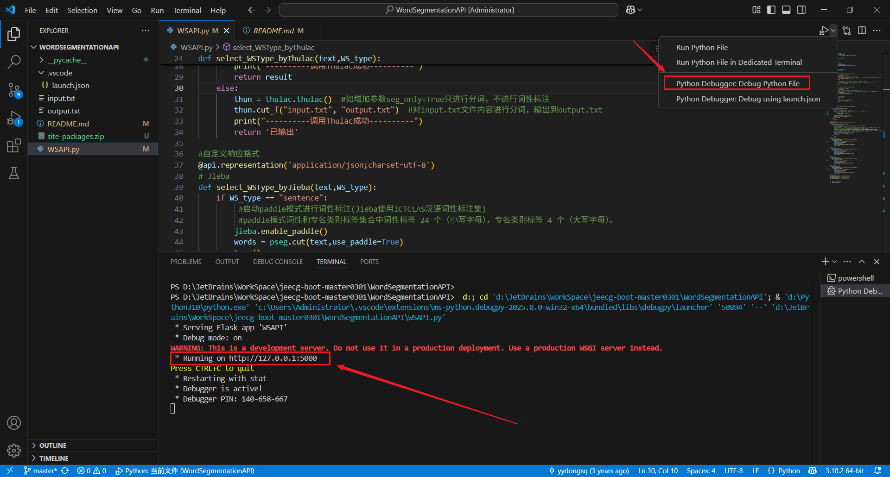
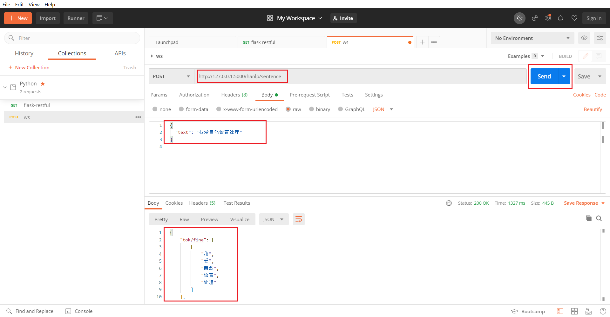

# NLP

## 1. 安装Python

**Python：** 安装Python 3版本，推荐使用Python3.10.x（如3.10.2）或Python3.9.x（如3.9.10）。

**Python下载官网：** https://www.python.org/downloads/windows/、https://www.python.org/ftp/python/3.9.10/python-3.9.10-amd64.exe

**添加环境变量：** path中添加E:\Python\Python310（使用自己的下载路径），同时删除path中其他Python版本的路径，避免影响。

**验证Python版本：**

```shell
python -V

# 输出
Python 3.10.2
```

## 2. pip包管理工具

### 2.1 pip简介

**pip简介：** Python包管理工具，提供了对Python包的查找、下载、安装、卸载的功能。（pip已内置于Python3.4和2.7及以上版本，其它版本需另行安装）。

**pip下载官网:** https://pypi.python.org/pypi/pip#downloads、https://files.pythonhosted.org/packages/99/bb/696e256f4f445809f25efd4e4ce42ff99664dc089cafa1e097d5fec7fc33/pip-22.1.tar.gz

**进入解压后的目录，执行命令：**

```shell
python setup.py install
```

**配置pip环境变量：** 首先找到pip的路径，位于python安装目录的Script文件夹中，将该路径复制后添加到path的环境变量中，最后在命令行窗口输入pip list。

### 2.2 修改源镜像

**pip修改为国内镜像:** 由于Python现在下载源都是默认国外的，而国外的源又都太慢，并且很容易下载失败，所以可以更换源为国内的镜像，比较常用的有清华、中科大、阿里等，推荐使用阿里镜像。

**临时使用国内镜像:** 可以在pip的时候在后面加上-i参数，指定pip源。

```shell
pip install scrapy -i https://mirrors.aliyun.com/pypi/simple
```

**永久修改源：**

**Linux:** 修改~/.pip/pip.conf（没有就创建一个）

```shell
[global]
index-url = https://pypi.tuna.tsinghua.edu.cn/simple
```

**Windows:** 直接在user目录中创建一个pip目录，如C:\User\xx\pip，在pip目录下创建文件pip.ini，或者win+r打开输入%HOMEPATH%，在此目录下创建pip文件夹，在pip目录中创建pip.ini文件。

```shell
[global]
timeout = 6000
index-url = https://pypi.tuna.tsinghua.edu.cn/simple
trusted-host = pypi.tuna.tsinghua.edu.cn

# 如清华源不可用，使用阿里镜像
[global]
timeout = 6000
index-url = https://mirrors.aliyun.com/pypi/simple/
trusted-host = mirrors.aliyun.com
```

**pip下载资源的默认路径:** python安装依赖的默认目录/Lib/site-package/，可直接解压项目目录下的site-packages.zip，适用于Python 3.10.2、pip 21.2.4。

**下载整理好的依赖库：** 百度网盘链接 https://pan.baidu.com/s/1ZKS7kl_WS_8cwz1ZtJPToQ 提取码: yyds

### 2.3 pip命令

**查看所有下载的包列表：**

```shell
pip list
```

**卸载指定包：**

```shell
pip uninstall 包名
```

## 3. flask Web框架

### 3.1 flask下载

**flask:** Python Web框架，使用Flask RESTful 工具封装Python代码为RESTful API接口。

**Flask RESTful的文档地址：** https://flask-restful.readthedocs.io/en/latest/。

**安装flask：**

```shell
pip install flask
```

**flask前端模板引擎默认是jinja2，需要安装jinja2：**

```shell
pip install jinja2
```

**安装Flask-RESTful库：**

```shell
pip install flask-restful
```

### 3.2 简单案例

**创建一个demo.py文件：**

```python
from flask import Flask
from flask import request

app = Flask(__name__)

@app.route('/', methods=['GET', 'POST'])
def home():
    return '<h1>hello world</h1>'

if __name__ == '__main__':
    app.run()
```

**运行程序:** 双击demo.py文件，使用Python39解释器运行，Flask自带的Server在端口5000上监听，打开浏览器，输入首页地址：http://localhost:5000/，会出现Hello World。

### 3.3 原始RESTful实现

**创建restful.py文件：**

```python
#!/usr/bin/env python
# -*- coding: utf-8 -*-
# by vellhe 2017/7/9
from flask import Flask, abort, request, jsonify

app = Flask(__name__)

# 测试数据暂时存放
tasks = []

@app.route('/add_task/', methods=['POST'])
def add_task():
    if not request.json or 'id' not in request.json or 'info' not in request.json:
        abort(400)
    task = {
        'id': request.json['id'],
        'info': request.json['info']
    }
    tasks.append(task)
    return jsonify({'result': 'success'})


@app.route('/get_task/', methods=['GET'])
def get_task():
    if not request.args or 'id' not in request.args:
        # 没有指定id则返回全部
        return jsonify(tasks)
    else:
        task_id = request.args['id']
        task = filter(lambda t: t['id'] == int(task_id), tasks)
        return jsonify(task) if task else jsonify({'result': 'not found'})


if __name__ == "__main__":
    # 将host设置为0.0.0.0，则外网用户也可以访问到这个服务
    app.run(host="0.0.0.0", port=8383, debug=True)
```

**使用Postman调用：** http://127.0.0.1:8383/add_task/，{"id": 123, "info": "测试任务"}

### 3.4 Flask-RESTful实现

**安装Flask-RESTful库：**

```shell
pip install flask-restful
```

**创建flaskrestful.py文件：**

```python
#!/usr/bin/env python
# -*- coding: utf-8 -*-
# by vellhe 2017/7/9

# 引入需要的库名、函数、变量等，并做简单的Application初始化
from flask import Flask
from flask_restful import reqparse, abort, Api, Resource

app = Flask(__name__)
api = Api(app)

# 定义我们需要操作的资源类型（都是json格式）
TODOS = {
    'todo1': {'task': 'build an API'},
    'todo2': {'task': '哈哈哈'},
    'todo3': {'task': 'profit!'},
}


def abort_if_todo_doesnt_exist(todo_id):
    if todo_id not in TODOS:
        abort(404, message="Todo {} doesn't exist".format(todo_id))

# Flask-RESTful提供了一个用于参数解析的RequestParser类，类似于Python中自带的argparse类，可以很方便的解析请求中的-d参数，并进行类型转换。
parser = reqparse.RequestParser()
parser.add_argument('task')

# 我们观察标准的API接口，这里的接口可以分为两类：带有item_id的，和不带item_id的。
# 前者是操作单一资源，后者是操作资源列表或新建一个资源。

# # 操作（put / get / delete）单一资源Todo
# shows a single todo item and lets you delete a todo item
class Todo(Resource):
    def get(self, todo_id):
        abort_if_todo_doesnt_exist(todo_id)
        return TODOS[todo_id]

    def delete(self, todo_id):
        abort_if_todo_doesnt_exist(todo_id)
        del TODOS[todo_id]
        return '', 204

    def put(self, todo_id):
        args = parser.parse_args()
        task = {'task': args['task']}
        TODOS[todo_id] = task
        return task, 201


# # 操作（post / get）资源列表TodoList
# shows a list of all todos, and lets you POST to add new tasks
class TodoList(Resource):
    def get(self):
        return TODOS

    def post(self):
        args = parser.parse_args()
        todo_id = int(max(TODOS.keys()).lstrip('todo')) + 1
        todo_id = 'todo%i' % todo_id
        TODOS[todo_id] = {'task': args['task']}
        return TODOS[todo_id], 201


# 设置路由，资源操作类定义完毕后，需要设置路由，即告诉Python程序URL的对应关系。
# 这样当我们请求url时，就能根据url的类型，找到相应的资源类，并调用对应的方法。
api.add_resource(TodoList, '/todos')
api.add_resource(Todo, '/todos/<todo_id>')

if __name__ == '__main__':
    app.run(debug=True)
```

**查询列表：** GET http://localhost:5000/todos form-data

**查询单任务：** GET http://localhost:5000/todos/todo4 form-data

**删除任务：** DELETE http://localhost:5000/todos/todo4 form-data

**添加任务：** POST http://localhost:5000/todos json {"task": "test4"}

**更新任务：** PUT http://localhost:5000/todos/todo3 json {"task": "tes3"}

## 4. PyTorch框架

**PyTorch:** PyTorch是一个开源的Python机器学习库，基于Torch，用于自然语言等应用程序。

**安装PyTorch：**

```shell
pip3 install torch torchvision torchaudio
```

**避坑点:** win32是无法安装torch的，因此无法安装和使用cnocr，win64系统如果安装了python3.10，或许是因为版本太新，也无法安装合适的wheel、numpy、torch版本，因而也无法安装和使用cnocr，换用python3.9后，一切迎刃而解。

## 5. TensorboardX可视化工具

**Tensorboard:** Tensorboard作为TensorFlow中附加的强大的可视化工具，可以记录训练过程的数字、图像等内容，以方便研究人员观察神经网络训练过程，可是对于PyTorch等其他神经网络训练框架并没有功能像TensorFlow一样全面的类似工具，虽然Python还有visdom可视工具，但功能有限使用起来比较困难。

**TensorboardX:** TensorboardX这个工具使得TensorFlow外的其他神经网络框架也可以使用Tensorboard的便捷功能，TensorboardX完美支持了Tensorboard常用的function，因为TensorboardX是对Tensorboard进行了封装后，开放出来使用的，所以必须先安装Tensorboard，再安装TensorboardX。

**安装TensorboardX：**

```shell
pip install tensorboardX
pip install tensorboard
pip install tensorflow
```

## 6. tqdm进度条库

**tqdm库:** 显示循环进度条的库，tqdm可以在长循环中添加一个进度提示信息，用户只需要封装任意迭代器tqdm(iterator)，是一个快速、扩展性强的进度条工具库。

**tqdm库的安装：**

```shell
pip install tqdm
```

## 7. numpy库

**NumPy：** NumPy（Numerical Python）是一个功能强大的Python库，主要提供了对多数组执行计算，在编写机器学习算法时，需要对矩阵进行各种数值计算，例如矩阵乘法、换位、加法等，NumPy提供了用于在简单和快速计算，NumPy数组用于存储训练数据和机器学习模型的参数。

**NumPy的安装:** 要求Python的版本在3.5以上。注：在安装pip install tensorflow时已经安装了NumPy。

```shell
pip install  numpy
```

**matplotlib:** matplotlib库是基于NumPy的一套Python的工具包，它提供了大量的数据绘图工具。

**matplotlib安装：**

```shell
pip install matplotlib
```

**Scipy:** Scipy库是sklearn库的基础，它是基于NumPy的一个集成了多种数学算法和函数的Python模块。在安装它之前需要安装numpy+mkl，另外只能使用手动安装，因为通过pip我们是下载不到的。

**numpy+mkl的下载地址:** https://www.lfd.uci.edu/~gohlke/pythonlibs/#numpy、https://github.com/cgohlke/numpy-mkl-wheels/releases/download/v2023.1.4/numpy-1.23.5+mkl-cp39-cp39-win_amd64.whl

**numpy+mkl的安装:** 下载成功后切换到包存放的文件夹，在此文件夹下打开cmd。

```shell
pip install numpy-1.22.2+mkl-cp39-cp39-win_amd64.whl
```

**Scipy的下载地址:** http://www.lfd.uci.edu/~gohlke/pythonlibs/#scipy、https://github.com/cgohlke/numpy-mkl-wheels/releases/download/v2023.1.4/SciPy-1.9.3-cp39-cp39-win_amd64.whl

**Scipy的安装:** 下载成功后切换到包存放的文件夹，在此文件夹下打开cmd。

```shell
pip install scipy-1.8.0-cp39-cp39-win_amd64.whl
```

## 8. sklearn库

**sklearn:** sklearn（scikit-learn）库是一个基于Python的第三方模块，sklearn库集成了一些常用的机器学习算法，在并不需要实现算法，只需要简单的调用sklearn库中提供的模块就能完成大多数的机器学习任务。

**sklearn的下载地址:** http://www.lfd.uci.edu/~gohlke/pythonlibs/#sklearn、https://pypi.org/project/scikit_learn/、https://files.pythonhosted.org/packages/0b/5f/f9a191519f6daf2c268256511c38e0cf638ff8e308bcadaf96a69e3e85af/scikit_learn-1.0.2-cp39-cp39-win_amd64.whl

**sklearn安装:** sklearn库是在NumPy、Scipy、matplotlib的基础上开发而成的，因此在安装sklearn之前，需要先安装这些依赖库。

**sklearn的安装:** 下载成功后切换到包存放的文件夹，在此文件夹下打开cmd。

```shell
pip install scikit_learn-1.0.2-cp39-cp39-win_amd64.whl
```

## 9. 异常解决

### 9.1 导包异常

**异常信息：** cannot import name 'url_encode' from 'werkzeug' 

**解决方案：**

```shell
pip install werkzeug==0.16.0
```

**异常信息：**  cannot import name 'ContextVar' from 'werkzeug.local' 

**解决方案：**

```shell
pip install werkzeug==0.16.0
```

**异常信息：**   cannot import name 'url_encode' from 'werkzeug' 

**解决方案：**

```
pip install flask==1.0
```

**异常详情：** cannot import name 'json' from 'itsdangerous' 

**解决方案：**

```shell
pip install itsdangerous==1.1.0
# 不能使用
# pip install flask==2.0.2
```

**异常：** module 'tensorflow' has no attribute 'contrib' 

**解决方案：**

```shell
 pip install tensorflow==1.15.0 
```

### 9.2 普通异常

**异常详情:** No module named 'cv2' 

**解决方案：**

```shell
pip install opencv-python
```

**异常：** "xrange" is not defined 

**解决方案：** 在Python3中，range()与xrange()合并为range( )，  将xrange( )函数全部换为range( )。 

**异常：**  The flag 'log_dir' is defined twice.  

**解决方案:** 这是tensorflow1.14版本问题，tf1.14本身就定义了**logging**，不需要二次定义。
报错显示**Second from train.py**，只需要在train.py中找到对应的log定义代码，删掉就好。 

### 9.3 Vue启动报错

**TypeError: Cannot set property ‘parent‘ of undefined异常解决：** https://blog.csdn.net/sinat_36733279/article/details/140484499

## 10. 分词工具

**导入Thulac分词工具：**

```shell
pip install thulac	#通过 import thulac 来引用
```

**导入jieba分词工具：**

```shell
pip install jieba	#通过import jieba 来引用 （第一次import时需要构建Trie树，需要几秒时间）
```

**导入LTP分词工具：**

```shell
pip install ltp	

from ltp import LTP
ltp = LTP() # 默认加载 Small 模型
```

**LSTM-CRF：**

```shell
pip install tensorflow
```

**导入HanLP分词工具：**

```shell
pip install hanlp -U
```

## 11. 运行项目

**使用Vscode打开项目：**



**使用Postman工具测试分词接口是否可用：** url中可以使用不同的分词工具，例如http://127.0.0.1:5000/jieba/sentence、http://127.0.0.1:5000/thulac/sentence、http://127.0.0.1:5000/ltp/sentence


